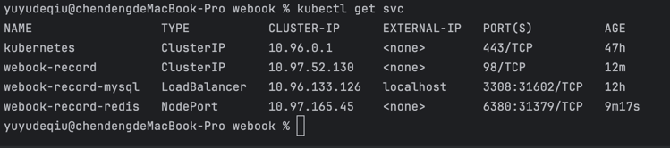
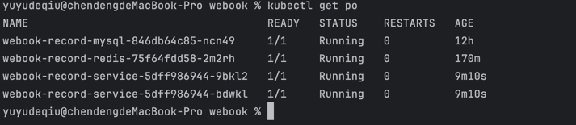

## 作业3

- 将 webook 的启动端口修改 8081。
- 将 webook 修改为部署 2 个 Pod。
- 将 webook 访问 Redis 的端口修改为 6380。
- 将 webook 访问 MySQL 的端口修改为 3308。

### kubectl get services 的截图

### kubectl get pods 的截图

### 你通过浏览器访问 webook，能够正确得到响应的截图

